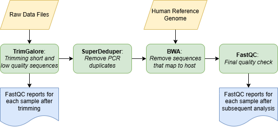

# Metagenomic Preprocessing and Taxonomic Classification
Our pipeline aims to replicate the preprocessing and taxonomic classification steps from
"Short- and long-read metagenomics of urban and rural South African gut microbiomes reveal 
a transitional composition and undescribed taxa" by Tamburini et al. using the ARC 
computing cluster at Virginia Tech.

Link to paper: [https://www.nature.com/articles/s41467-021-27917-x](https://www.nature.com/articles/s41467-021-27917-x)



## Important Notes! Please read before continuing.

### Changing bash script parameters before use
*All scripts are found in the scripts folder of GitHub. Make sure that when using any bash scripts from this page that you update the slurm instructions at the top to use your own ARC allocation and email for notifications! There are comments in all the scripts to help you see which parameters to change.*

### Changing filepaths in scripts
*Each section below details the file paths that need to be changed in each script and all scripts contain comments on where to update the filepaths. To avoid getting errors, make sure to change all file paths to your own input/output folders. All scripts have been edited to have a non-existent filepath in all the places where you need to input your own filepath.*

### Checking output files
*In the "Outfile_Ex" folder on Github, there are example error and outfiles from slurm for each step that can be check against your outfiles to help with assuring that the pipeline is running properly.*

## 00. Test Dataset
The raw test dataset for peer review can be found at the path: `/projects/intro2gds/I2GDS2025/TestData_LinuxPeerEval/G5_testdata/rawdata`

This data consists of 3 paired FASTQ files (6 sequence files in total) that have been subsetted and will run through the pipeline very quickly.

## 01. TrimGalore

The purpose of TrimGalore is to trim sequences, remove short sequences, and remove sequences with low quality scores.

Before running the analysis, first create a directory for all TrimGalore output files.
```
mkdir -p /projects/intro2gds/I2GDS2025/G5_MG_AMR/01_Trim_Galore/ # change to your preferred directory path
```

TrimGalore was run using a bash script: `01_trim_galore_job.slurm`

**Script values to change for your specific setup:**
* Input directory path: where all the raw data files are located
* Output directory path: where all the sequence files coming out of TrimGalore should be saved
* Minimum quality score value (To replicate the paper, we used 30)
* Minimum sequence length (To replicate the paper, we used 60)

**Inputs**: Raw paired FASTQ/FASTQ.GZ files for each sample
* Example: `SRR17048876_1.fastq` and `SRR17048876_2.fastq`

**Outputs**: Trimmed FASTQ files, .html and .zip FastQC output files, and a .txt trimming report file for raw sequence file
* Example: `SRR17048876_1_val_1.fq`, `SRR17048876_1_val_1_fastqc.html`, `SRR17048876_1_val_1_fastqc.zip`, and `SRR17048876_1.fastq_trimming_report.txt`

**What the script does:**
1. Loads the TrimGalore module on ARC
2. Defines the input directory where the raw data files are located and the output directory where the trimmed sequence files will be saved
3. Changes the working directory to the input directory and loops through all sequence files to run them through TrimGalore

Once all batch script parameters and filepaths are updated in the script, navigate to the directory that your script is located in and use the following line of code to submit the job on ARC.
```
sbatch 01_trim_galore_job.slurm
```

## 02. Super Deduper

The purpose of SuperDeduper is to remove PCR and optical duplicate reads from paired-end FASTQ files generated after adapter trimming (in this case, from Trim Galore).
This step ensures that downstream analyses such as assembly or host mapping are not biased by artificially duplicated reads.

Before running the analysis, first create a directory for all SuperDeduper output files:
```
mkdir -p /projects/intro2gds/I2GDS2025/G5_MG_AMR/02_after_deduper/  
```

### 02a. Preparation of the environment
To run superdeduper, we first need to build a conda virtual environment that contains the HTStream toolkit, which can provide the ```hts_SuperDeduper``` program. 

First, we need to load Miniconda
```
## Load Miniconda module (if available)
module load miniconda3

## check miniconda version
conda --version
```
Secondly, we create a virtual environment called htstream12
```
# Create and activate the environment
conda create -y -n htstream12 python=3.10
conda activate htstream12
```
Thirdly, Install HTStream (which includes SuperDeduper). HTStream can be installed via Bioconda, which provides precompiled packages for bioinformatics tools.
```
# 1. Add the proper Conda channels in the correct priority order:
conda config --add channels defaults
conda config --add channels bioconda
conda config --add channels conda-forge

# 2. Install HTStream 
conda install -y htstream

# 3. Verify the correct installation of SuperDeduper
# Check if command is recognized
which hts_SuperDeduper
# Check version
hts_SuperDeduper --version
```
### Run SuperDeduper Analysis
Once the conda environment was set up, SuperDeduper analysis was run using a bash script: `02_run_superdeduper_cpu.slurm`

**Script values to change for your specific setup:**
* Input directory path: Where all the output files from TrimGalore are located
* Output directory path: Where all the sequence files coming out of SuperDeduper should be saved

**Inputs**: Paired FASTQ/FASTQ.GZ files from TrimGalore output
* Example: `SRR17048876_1_val_1.fq` and `SRR17048876_1_val_.fq`

**Outputs**: Deduplicated paired FASTQ files
* Example: 	`SRR17048876_R1.fastq.gz` and `	SRR17048876_R2.fastq.gz`

**What the script does:**
1. Loads the conda environment (htstream12) that contains the HTStream toolkit, including SuperDeduper.
2. Defines both the input and output directory paths.
3. Creates the output directory if it does not already exist.
4. Scans through all *_1_val_1.fq files in the input folder.
5. For each detected sample, identifies its mate file (*_2_val_2.fq) and runs SuperDeduper
6. Checks whether both deduplicated files (```_R1.fastq.gz``` and ```_R2.fastq.gz```) were successfully created.
7. Prints progress messages such as ```[INFO]```, ```[OK]```, or ```[WARN]``` to help track pipeline execution.

Once all batch script parameters and filepaths are updated in the script, navigate to the directory that your script is located in and use the following line of code to submit the job on ARC.
```
sbatch 02_run_superdeduper_cpu.slurm
```

## 03. BWA

### 03a. Download and index human reference genome

In order to run BWA, we have to have a human reference genome to compare to. 
For our analysis, we downloaded the same human reference genome used in the paper
we are trying to replicate. 

There are a few different steps to download the genome and convert 
it to a usable format for BWA.

1. Download reference genome
```
mkdir -p /projects/intro2gds/I2GDS2025/G5_MG_AMR/03a_Human_ref/ # change to your preferred directory path
cd /projects/intro2gds/I2GDS2025/G5_MG_AMR/03a_Human_ref/
wget http://hgdownload.soe.ucsc.edu/goldenPath/hg19/bigZips/hg19.2bit;
```
2. Convert to fasta format
```
wget http://hgdownload.cse.ucsc.edu/admin/exe/linux.x86_64/twoBitToFa;
chmod +x twoBitToFa;
./twoBitToFa hg19.2bit hg19.fa;
```
3. Create bowtie index for BWA to use for comparisons
This final step of obtaining the reference genome was completed with a bash script: `03a_index_human_ref.sh`
This script loads the ARC module used to access BWA commands, set the current directory to the folder
where you downloaded the reference genome, and runs the command used to index the reference genome. 

***Note**: If you have any issues downloading and indexing the human reference genome or you are short on time, a folder with the already downloaded and indexed reference genome is provided at this path: `/projects/intro2gds/I2GDS2025/TestData_LinuxPeerEval/G5_testdata/03a_Human_ref`*

### Run BWA Analysis

The purpose of BWA is to remove all sequences that map to the host genome (in this case, the human genome).

Before running any analysis, first create a directory for all BWA output files.
```
mkdir -p /projects/intro2gds/I2GDS2025/G5_MG_AMR/03_BWA/ # change to your preferred directory path
```

BWA analysis was run using a bash script: `03_BWA.sh`

**Paths in script to change for your specific setup:**
* Input directory path: Where all the paired sequence files going into BWA are located
* Output directory path: Where all the sequence files coming out of BWA should be saved
* Path to human reference genome

**Input**: Paired FASTQ/FASTQ.GZ files for each sample from SuperDeduper output
* Example: `SRR17048876_R1.fastq.gz` and `SRR17048876_R2.fastq.gz`

**Output**: Paired FASTQ/FASTQ.GZ files for each sample along with a singletons file where any sequences whose pair mapped to the human reference is saved
* Example: `SRR17048876_1.fq.gz`, `SRR17048876_2.fq.gz`, and `SRR17048876_singletons.fq.gz`

**What the script does:**
1. Loads the BWA module on ARC
2. Defines the input directory where the samples going into BWA are located (In this case, the output sequences
from super deduper) and the output directory where the files with human mapped sequences removed will be saved
3. Changes the working directory to the input directory, loops through all sequence files and runs them through 
BWA, and then uses samtools to process the output from BWA and save the unmapped sequences as fastq files

Once all batch script parameters and filepaths are updated in the script, navigate to the directory that your script is located in and use the following line of code to submit the job on ARC.
```
sbatch 03_BWA.sh
```

***Notes**:*
*The output from BWA for each sample is three files instead of two like the input. This is because sometimes when mapping sequences to the reference genome only one half of a pair will map to the reference. In this case, only the one sequence that mapped is removed and the now unpaired sequence is saved to the singletons file. Thus, each sample has two paired-read files and a singletons file as output for BWA.*

## Peer Reviewers please stop here! No need to do more than the first 3 steps :)
---

## 04. Final quality check with FastQC

FastQC as a final quality check before classification was run using a bash script: `04_fastqc.sh`

Before running any analysis, first create a directory for all FastQC output files.
```
mkdir -p /projects/intro2gds/I2GDS2025/G5_MG_AMR/04_fastqc/ # change to your preferred directory path
```

**Paths in script to change for your specific setup:**
* Input directory path: where all the sequence files going into fastqc are located
* Output directory path: Where all the sequence files coming out of fastqc should be saved

**Input**: Paired FASTQ/FASTQ.GZ files and singleton files for each sample from BWA output
* Example: `SRR17048876_1.fq.gz`, `SRR17048876_2.fq.gz`, and `SRR17048876_singletons.fq.gz`

**Output**: .html and .zip files containing the sequence quality info for each sequence file
* Example: `SRR17048876_1_fastqc.html` and `SRR17048876_1_fastqc.zip`

**What the script does:**
1. Loads the FastQC module on ARC
2. Changes working directory to input directory (In this case, the BWA output folder)
3. Runs FastQC on all input files and saves output files to the output directory

Once all batch script parameters and filepaths are updated in the script, navigate to the directory that your script is located in and use the following line of code to submit the job on ARC.
```
sbatch 04_fastqc.sh
```

***Notes**:*
*This step was completed to assure that quality of sequences stayed high after the super deduper and BWA analyses.*

